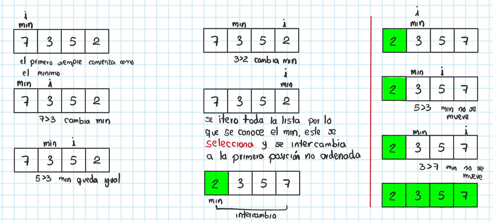
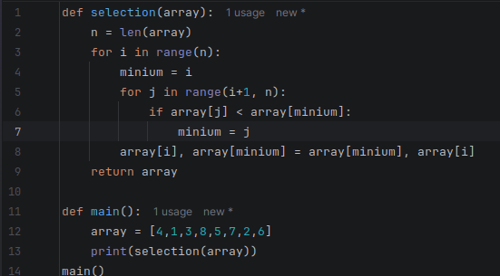

# Algoritmos de ordenamiento

La idea principal de un algoritmo de ordenamiento es que, dado un arreglo o un conjunto de elementos, se organicen de menor a mayor. Por ejemplo, transformar un arreglo como `[5, 2, 3, 1, 4]` de manera que quede como `[1, 2, 3, 4, 5]`.

Para lograr esto existen distintos algoritmos de ordenamiento que varían en la forma en que iteran para organizar los datos y en su complejidad, ya que algunos algoritmos son más eficientes que otros.

## Clasificación por eficiencia 

| Algoritmo | Complejidad |
| :--- | :---: | 
| Bubble Sort | O(n²) | 
| Selection Sort | O(n²)| 
| Insertion Sort | O(n²)|
| Merge Sort | O(n log(n)) |
| Quick Sort | O(n log(n)) |
| Heap Sort | O(n log(n)) |

Vamos a analizar cada algoritmo del menos al más eficiente.

**NOTA:** Cada algoritmo tendrá su propia implementación dentro del `README.md`; sin embargo, la explicación detallada del código estará en su respectivo informe en formato `.ipynb`.

## Bubble Sort (Ordenamiento Burbuja)

Se le llama burbuja ya que sus elementos "burbujean" hasta el final de la estructura. Es el algoritmo menos eficiente de todos, por lo que actualmente se utiliza principalmente como ejercicio de aprendizaje y práctica. Su funcionamiento, dada una lista desordenada, se puede dividir en cuatro etapas:

1. Se compara el primer elemento con el segundo; si el primer elemento es mayor que el segundo, se intercambian.
2. Se avanza al siguiente par de elementos y se repite el proceso de comparación e intercambio.
3. Este proceso se repite hasta llegar al final de la lista. Una vez completado, se puede asegurar que el último elemento es el más grande de la lista.
4. Se repiten los pasos de la primera a la tercera etapa; sin embargo, en cada nueva iteración se ignora la última posición alcanzada, ya que los elementos más grandes ya se encuentran en su posición final.

Ejemplo gráfico:

Aquí se puede observar cómo se compara cada pareja de elementos, verificando que si el primer valor es mayor al segundo, este se intercambia hasta que la lista este ordenada.

### Implementación:

https://github.com/user-attachments/assets/34443e18-f77e-4ee4-924e-6dab5db8f060

**NOTA:** En el video se ve una implementacion parecida, su diferencia es que usa un swapped el cual se usa generalmente para verificar que la lista ya esta ordenada y se dentenga el proceso.

-------

## Selection Sort

Consiste en como dice su nombre seleccionar un elemento, ya sea el elemento mas pequeño o el mas grande, de manera que se vaya comparando con los demas mientras se itera la lista, en caso de encontrar un elemento mas pequeño o grande dependendiendo el caso que se este usando, este se reemplaza con el elemento encontrado, y asi sucesivamente hasta recorrer toda la lista, en ese caso el elemento seleccionado se lleva al principio o final de la lista, una vez ahi se vuelve a realizar el mismo proceso ignorando el elemento ordenado.

Ejemplo grafico:

Aqui se observa que primero se selecciona el elemento como el min ya que es el unico revisado, sin embargo mientras se recorre la lista, se busca un nuevo minimo hasta que se encuentra el elemento mas pequeño, una vez encontrado y finalizado el recorrido, ese elemento se lleva al principio de la lista y se intercambia con el elemento que se encuentra en esa posicion, en caso de que el elemento se encuentre justo en su posicion, entonces este se queda inmovil, se repite el proceso para cada elemento hasta que la lista quede arreglada.

### Implementacion

https://github.com/user-attachments/assets/d8796d12-ab31-425c-a851-4c1aa8a2d0d0

----

## Insertion Sort
